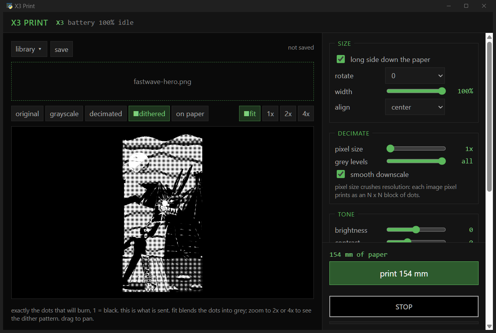

# X3 Print

The Orgbro X3 wants you to install its phone app. Skip it. Plug the printer into your
PC with a USB-C cable, open X3 Print in your browser and hit print. No spyware APK
sideloading. The page talks to the printer and to nothing else.

Mine is headed for the cyberdeck docking station to crank out stickers and labels on
demand.



## Get it

Download this repo as a ZIP, unzip it, and open `index.html` in Chrome, Edge or another
Chromium browser. Click connect printer and pick the X3. Firefox and Safari can't talk
to USB serial devices, so they won't work.

On Linux, Chrome also needs permission to open the port:

```
sudo cp linux/70-x3print.rules /etc/udev/rules.d/
sudo udevadm control --reload
```

Then replug the printer. The rule also keeps ModemManager off it.

## Worth knowing

- Paste an image or drop it on the window. Drag it in the preview to move it.
- Dots view is exactly what the head will burn. On paper is a rough guess at how the
  heat spreads it.
- The dots spread a little on paper. A bigger dither cell holds up better.
- Click any number to type it. Click a slider and the arrow keys or mouse wheel move it
  one step. Double click resets it.
- A preset saves the image, dither and printer settings for one paper or sticker stock.
  Size and position stay with the image.
- Anything you print goes into the library. The library and presets live in your
  browser's storage, so use export in the library before clearing site data or
  switching browsers.

## Print width

Because of a vendor lockout the X3 only takes rows of 864 dots, which leaves its print
about 2 mm short of one edge of the paper. X3 Print adds a 2 mm margin to the other
side so prints come out centred, at the cost of 4 mm of width in total. Dots are square,
300 dpi both ways, so one image pixel at 100% is one dot.

## Command line

There is also a Python command line version.

```
pip install pyserial pillow numpy
python -m x3print status
python -m x3print print photo.jpg --dither bayer2 --density 9
```

## The protocol

Worked out on one X3. Others in the family might work. None have been tried.

| | |
|---|---|
| USB | CDC serial, VID `0483` PID `5720` |
| Frame | `64` cmd seq len(u16 LE) payload integrity(u32 LE) `9B` |
| Integrity | `(0x12345678 + sum of all preceding bytes + 0x9B) & 0xFFFFFFFF` |
| Head | 864 dots, 108 bytes per row, MSB first, 1 = black. Other row lengths print nothing. |
| Raster | command `0x00`, whole 108 byte rows. Four rows per frame prints without pauses. |
| Status | the printer sends `0xFF` frames about three times a second: status bits, heat, auto off, speed, battery % |
| Commands | `0x12` model, `0x0A` speed, `0x09` heat, `0x28` paper type, `0x02` feed (dots) |

Command `0x20` prints the self test page the moment it arrives. Poking unknown command
IDs will cost you paper.

## Cyberdeck Cafe

Built at the Cyberdeck Cafe. More projects and the Discord are on Neon City Mix.

https://cyberdeck.cafe/

## Acknowledgements

The frame format and the first set of commands came from the Orgstra S001 driver in
TiMini-Print (Apache-2.0).

https://github.com/Dejniel/TiMini-Print

## License

Apache-2.0
